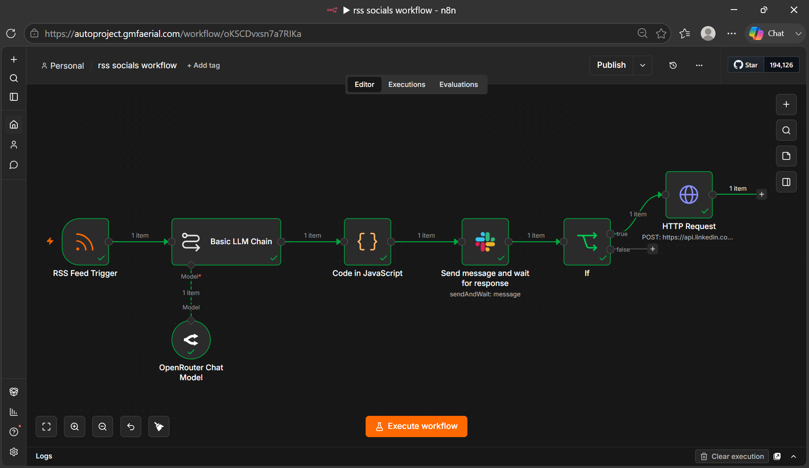

# 🤖 AI Social Media Content Pipeline

An end-to-end automated content pipeline that monitors RSS/news feeds, 
generates platform-specific social media posts using an LLM, routes them 
through a human approval step via Slack, and auto-publishes on approval.

Built with **n8n**, **OpenRouter**, **Slack API**, and **LinkedIn API**.

---

## 🚀 What It Does

1. **Monitors RSS feeds** for fresh articles on a schedule
2. **Generates platform-specific drafts** (LinkedIn, Twitter, Instagram) 
   using an LLM via OpenRouter
3. **Sends drafts to Slack** for human review with Approve/Reject buttons
4. **Auto-publishes to LinkedIn** on approval — rejected posts are 
   logged and discarded

---

## 🧠 Key Concept: Human-in-the-Loop AI

This pipeline demonstrates a critical principle in responsible AI 
automation — **no content goes live without human approval**.

The system is designed so that:
- AI handles the heavy lifting (content generation, formatting, routing)
- A human retains final judgment (quality control, brand safety)
- The workflow pauses and waits asynchronously for a decision

This is production-grade agentic AI design, not just a script.

---

## 🔧 Tech Stack

| Tool | Purpose |
|------|---------|
| n8n | Workflow orchestration |
| OpenRouter | LLM API (model-agnostic) |
| Slack API | Human-in-the-loop approval interface |
| LinkedIn API | Auto-publishing approved posts |
| RSS Feed Trigger | News/content monitoring |
| JavaScript (Code Node) | JSON parsing & data transformation |

---

## 🏗️ Architecture

RSS Feed Trigger

↓

Basic LLM Chain (OpenRouter)

↓

Code Node (Parse JSON output)

↓

Slack "Send & Wait" (Human Approval)

↓

┌─────────────┐

│             │

Approved       Rejected

│             │

LinkedIn      Log & Discard

Post

---

## ⚙️ Workflow Breakdown

### 1. RSS Feed Trigger
- Polls a configurable RSS feed URL on a set schedule
- Fires the workflow only when new articles are detected
- Passes article `title`, `link`, and `contentSnippet` downstream

### 2. LLM Content Generation
- Sends article data to an LLM via OpenRouter
- Prompts the model to return structured JSON with three platform drafts:
  - **LinkedIn**: Professional tone, 100-150 words, ends with a question
  - **Twitter/X**: Under 280 characters, punchy, 1-2 hashtags
  - **Instagram**: Casual tone, emojis, 3-5 hashtags
- Model used: `openai/gpt-4o-mini` (configurable)

### 3. Code Node (JSON Parser)
- Cleans and parses the LLM's JSON output
- Extracts individual platform drafts
- Passes structured data to the approval step

### 4. Slack Approval (Human-in-the-Loop)
- Sends a formatted Slack message to a designated channel
- Displays all three drafts alongside the article title and link
- Workflow **pauses and waits** for a human to click Approve or Reject
- Uses n8n's native "Send and Wait" operation

### 5. LinkedIn Publishing
- On approval, calls LinkedIn's REST API (`/rest/posts`)
- Posts the LinkedIn draft to the authenticated user's profile
- Returns a success confirmation to Slack

---

## 🔐 Environment Setup

You will need the following credentials:

| Credential | Where to Get It |
|-----------|----------------|
| OpenRouter API Key | [openrouter.ai](https://openrouter.ai) |
| Slack Bot Token | [api.slack.com/apps](https://api.slack.com/apps) |
| LinkedIn Access Token | [LinkedIn Developer Portal](https://www.linkedin.com/developers) |

All credentials are stored securely in **n8n's Credentials Manager** 
— no hardcoded secrets anywhere in the workflow.

---

## 📸 Workflow Screenshot

> **

---

## 📋 How to Run

1. Import the workflow JSON into your n8n instance
2. Add your credentials (OpenRouter, Slack, LinkedIn)
3. Configure your RSS feed URL in the trigger node
4. Activate the workflow
5. Wait for a new article to trigger the pipeline — or test manually

---

## 🎯 Skills Demonstrated

- **Agentic AI design** — multi-step autonomous workflows with 
  human oversight
- **API integration** — REST APIs for Slack and LinkedIn
- **LLM prompt engineering** — structured JSON output, 
  platform-specific tone control
- **Workflow orchestration** — n8n node chaining, 
  async wait patterns, conditional branching
- **MLOps principles** — modular pipeline design, 
  error handling, credential management

---

## 👤 Author

**Mrwopa** — AI/ML Engineer  
Specializing in Agentic AI, MLOps, LangChain, LangGraph, 
NLP & Computer Vision

[

---

## 📄 License

This project is licensed under the MIT License — 
see the [LICENSE](LICENSE) file for details.
